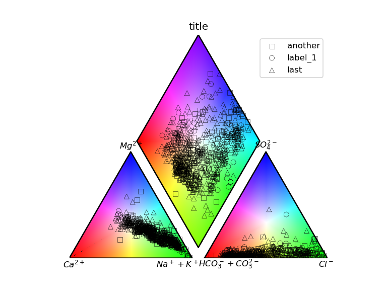

THIS LIBRARY IS NOW OUT OF DATE.  PLEASE USE [WQChartPy](https://github.com/jyangfsu/WQChartPy) AS IT IS BY THE ORIGINAL AUTHOR AND MUCH MORE ROBUST.

# Peeters_Piper
This script plots a piper diagram of water chemisty.
It includes an ArcGIS Toolbox for use in ArcGIS Pro.

## Reference
This script was taken from Peeters 2014 in Groundwater <br>
``` bibtex
@article {GWAT:GWAT12118,
author = {Peeters, Luk},
title = {A Background Color Scheme for Piper Plots to Spatially Visualize Hydrochemical Patterns},
journal = {Groundwater},
volume = {52},
number = {1},
publisher = {Blackwell Publishing Ltd},
issn = {1745-6584},
url = {http://dx.doi.org/10.1111/gwat.12118},
doi = {10.1111/gwat.12118},
pages = {2--6},
year = {2014},
}
```
Please refer to the original publication for licensing guidelines.

## Installation

``` cmd
pip install https://github.com/inkenbrandt/Peeters_Piper/zipball/master 
```

## Example

``` python
import pandas as pd
import numpy as np
import matplotlib.pyplot as plt

from peeters_piper.peeter_piper import piper

filename = "examples/GW20130314-0057-s02_additional_field.csv"

df = pd.read_csv(filename)

# Plot example data
# Piper plot
fig = plt.figure()
markers = ["s", "o", "^", "v", "+", "x"]
arrays = []
for i, (label, group_df) in enumerate(df.groupby("additional-field")):
    arr = group_df.iloc[:, 2:10].values
    arrays.append(
        [
            arr,
            {
                "label": label,
                "marker": markers[i],
                "edgecolor": "k",
                "linewidth": 0.3,
                "facecolor": "none",
            },
        ]
    )

rgb = piper(arrays, "title", use_color=True, fig=fig)
plt.legend()
fig.savefig(filename + "_piper_plot.png", dpi=120)
```


